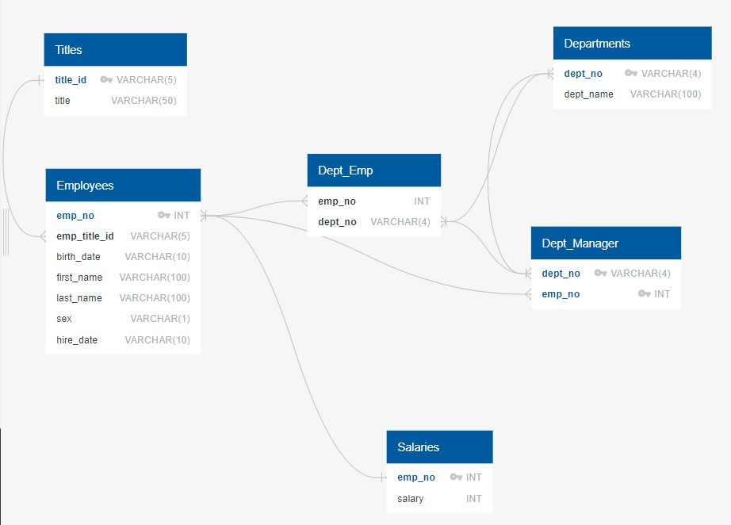

# sql-challenge
In this assignment, you will design the tables to hold data in the CSVs, import the CSVs into a SQL database, and answer questions about the data. In other words, you will perform **data modeling**, **data engineering**, and **data analysis**.
## Before You Begin

## Instructions

This assignment is divided into three parts: data modeling, data engineering, and data analysis.

#### Data Modeling

Inspect the CSVs and sketch out an ERD of the tables. Feel free to use a tool like [http://www.quickdatabasediagrams.com](http://www.quickdatabasediagrams.com).

#### Data Engineering

* Use the provided information to create a table schema for each of the six CSV files. Remember to specify data types, primary keys, foreign keys, and other constraints.

  * For the primary keys, verify that the column is unique. Otherwise, create a [composite key](https://en.wikipedia.org/wiki/Compound_key), which takes two primary keys to uniquely identify a row.

  * Be sure to create tables in the correct order to handle foreign keys.

* Import each CSV file into the corresponding SQL table.

  > **Hint:** To avoid errors, be sure to import the data in the same order that the tables were created. Also remember to account for the headers when importing.

#### Data Analysis

Once you have a complete database, perform these steps:

1. List the following details of each employee: employee number, last name, first name, sex, and salary.
 
```python
SELECT 
	e.emp_no,
	e.last_name,
	e.first_name,
	e.sex,
	s.salary
FROM employees e
	INNER JOIN salaries s
		ON e.emp_no = s.emp_no
```

2. List first name, last name, and hire date for employees who were hired in 1986.

```python
SELECT
	first_name,
	last_name,
	hire_date
FROM
	employees
WHERE EXTRACT(YEAR FROM hire_date) = 1986
ORDER BY hire_date ASC;
```

3. List the manager of each department with the following information: department number, department name, the manager's employee number, last name, first name.

```python
SELECT 
	d.dept_no,
	d.dept_name,
	dm.emp_no,
	e.last_name,
	e.first_name
FROM departments d
	INNER JOIN dept_manager AS dm
		ON d.dept_no = dm.dept_no
	INNER JOIN employees e
		ON dm.emp_no = e.emp_no
```

4. List the department of each employee with the following information: employee number, last name, first name, and department name.

```python
SELECT 
	de.emp_no,
	e.last_name,
	e.first_name,
	d.dept_name
FROM dept_emp AS de
	INNER JOIN employees AS e
		ON de.emp_no =  e.emp_no
	INNER JOIN departments AS d
		ON d.dept_no = de.dept_no
```

5. List first name, last name, and sex for employees whose first name is "Hercules" and last names begin with "B."
```python
SELECT 
	first_name,
	last_name,
	sex
FROM 
	employees
WHERE 
	first_name = 'Hercules' AND
	last_name LIKE 'B%'
```

6. List all employees in the Sales department, including their employee number, last name, first name, and department name.

```python
SELECT 
	de.emp_no,
	e.last_name,
	e.first_name,
	d.dept_name
FROM dept_emp AS de
	INNER JOIN employees AS e
		ON de.emp_no =  e.emp_no
	INNER JOIN departments AS d
		ON d.dept_no = de.dept_no
WHERE d.dept_name = 'Sales'
```

7. List all employees in the Sales and Development departments, including their employee number, last name, first name, and department name.

```python
SELECT 
	de.emp_no,
	e.last_name,
	e.first_name,
	d.dept_name
FROM dept_emp AS de
	INNER JOIN employees AS e
		ON de.emp_no =  e.emp_no
	INNER JOIN departments AS d
		ON d.dept_no = de.dept_no
WHERE d.dept_name = 'Sales' OR 
	d.dept_name = 'Development'
```
8. List the frequency count of employee last names (i.e., how many employees share each last name) in descending order.

```python
SELECT 
	last_name,
	COUNT(last_name) AS "Total Count"
FROM 
	employees
GROUP BY last_name
ORDER BY "Total Count" DESC
```


###### ERD ######


# Phsical Model

Titles
-
title_id VARCHAR(5) PK
title VARCHAR(50)

Salaries
-
emp_no INT PK
salary INT

Employees
-
emp_no INT PK FK >- Salaries.emp_no
emp_title_id VARCHAR(5) FK >- Titles.title_id
birth_date DATE
first_name VARCHAR(100)
last_name VARCHAR(100)
sex VARCHAR(1)
hire_date DATE

Dept_Manager
-
dept_no VARCHAR(4) PK FK >- Dept_Emp.dept_no
emp_no INT PK FK >- Employees.emp_no

Dept_Emp
-
emp_no INT FK >- Employees.emp_no
dept_no VARCHAR(4) FK >- Departments.dept_no

Departments
-
dept_no VARCHAR(4) PK FK >- Dept_Manager.dept_no
dept_name VARCHAR(100)

# TABLE SCHEMA-----------------------------
```pyton
CREATE TABLE Titles (
    title_id VARCHAR(5)   NOT NULL,
    title VARCHAR(50)   NOT NULL,
    CONSTRAINT pk_Titles PRIMARY KEY (
        title_id
     )
);

CREATE TABLE Salaries (
    emp_no INT   NOT NULL,
    salary INT   NOT NULL,
    CONSTRAINT pk_Salaries PRIMARY KEY (
        emp_no
     )
);

CREATE TABLE Employees (
    emp_no INT   NOT NULL,
    emp_title_id VARCHAR(5)   NOT NULL,
    birth_date DATE   NOT NULL,
    first_name VARCHAR(100)   NOT NULL,
    last_name VARCHAR(100)   NOT NULL,
    sex VARCHAR(1)   NOT NULL,
    hire_date DATE   NOT NULL,
    CONSTRAINT pk_Employees PRIMARY KEY (
        emp_no
     )
);

CREATE TABLE Dept_Manager (
    dept_no VARCHAR(4)   NOT NULL,
    emp_no INT   NOT NULL,
    CONSTRAINT pk_Dept_Manager PRIMARY KEY (
        dept_no
     )
);

CREATE TABLE Dept_Emp (
    emp_no INT   NOT NULL,
    dept_no VARCHAR(4)   NOT NULL
);

CREATE TABLE Departments (
    dept_no VARCHAR(4)   NOT NULL,
    dept_name VARCHAR(100)   NOT NULL,
    CONSTRAINT pk_Departments PRIMARY KEY (
        dept_no
     )
);
```
ALTER TABLE Employees ADD CONSTRAINT fk_Employees_emp_no FOREIGN KEY(emp_no)
REFERENCES Salaries (emp_no);

ALTER TABLE Employees ADD CONSTRAINT fk_Employees_emp_title_id FOREIGN KEY(emp_title_id)
REFERENCES Titles (title_id);


ALTER TABLE Dept_Manager ADD CONSTRAINT fk_Dept_Manager_emp_no FOREIGN KEY(emp_no)
REFERENCES Employees (emp_no);

ALTER TABLE Dept_Emp ADD CONSTRAINT fk_Dept_Emp_emp_no FOREIGN KEY(emp_no)
REFERENCES Employees (emp_no);

ALTER TABLE Dept_Emp ADD CONSTRAINT fk_Dept_Emp_dept_no FOREIGN KEY(dept_no)
REFERENCES Departments (dept_no);

ALTER TABLE Departments ADD CONSTRAINT fk_Departments_dept_no FOREIGN KEY(dept_no)
REFERENCES Dept_Manager (dept_no);
